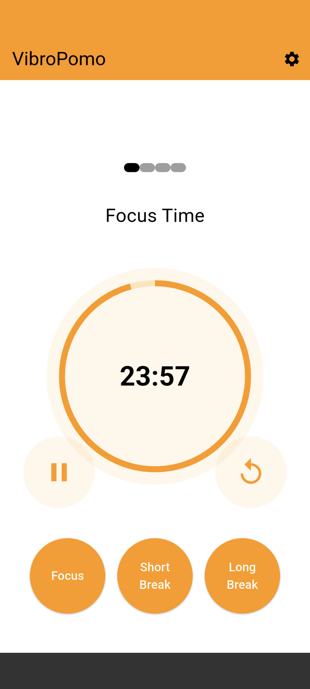
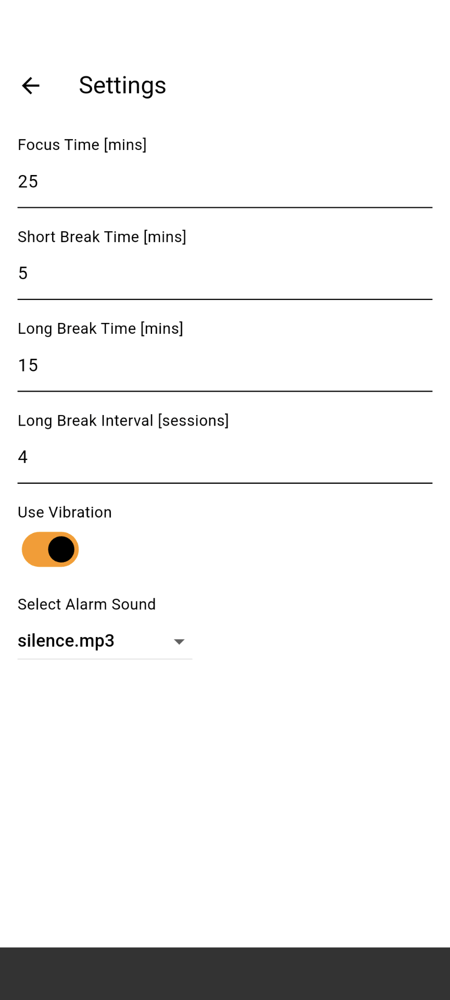

# VibroPomo (Vibration + Pomodoro method)

バイブレーション（振動）のみで通知する、シンプルなポモドーロタイマーです。
職場やカフェなど、周囲に人がいる環境でも、音を鳴らさずに使用できます。

無音で使えるポモドーロタイマーアプリは他にも多くありますが、休憩時間の長さをデフォルトから変えるだけで有料だったりしたので、自分で作成してみました。

	
	

## 対象OS
Android OS

## 注意点
個人利用のために作成したアプリです。そのため、Google Pixel 6でのみ動作確認を行っています。  
その他の端末での動作は保証できませんので、ご了承ください。

## 機能
- 作業・休憩タイマーの開始／終了通知
- バイブレーションによるアラーム
- 作業・休憩時間の長さの調整
- ポモドーロサイクルの回数の調整

## 必要な権限
- 通知: POST_NOTIFICATIONS（Android 13以降）
- 正確なアラーム: SCHEDULE_EXACT_ALARM／USE_EXACT_ALARM（Android 12以降）
- その他: WAKE_LOCK, VIBRATE, FOREGROUND_SERVICE

## 開発・ビルド
- 要件: Flutter 3.x 以降
- 実行: `flutter pub get` の後、`flutter run`
- インストール: `flutter build apk ; flutter install`
